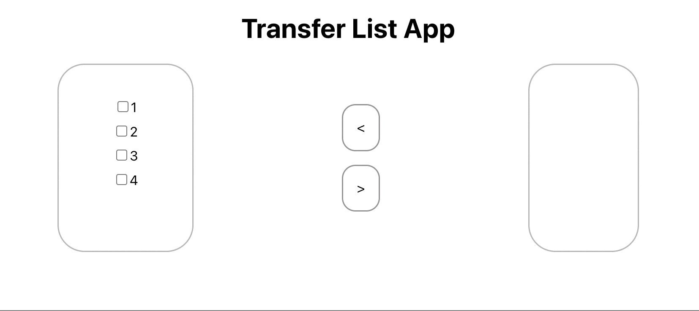

# Transfer list app using React

This project was created using [Create React App](https://create-react-app.dev/docs/getting-started).

In the project directory, you can run:

### `npm start`

## Here's the preview of the app

